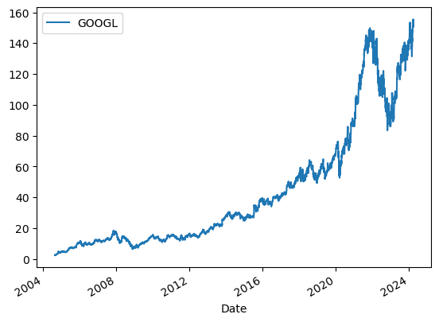
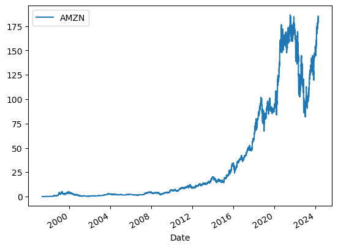
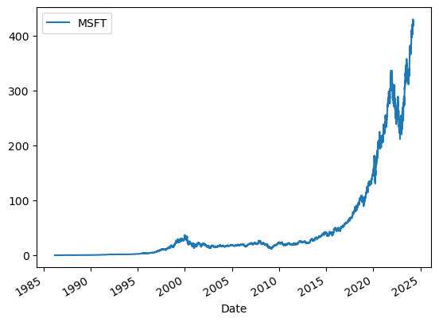
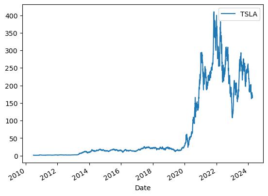
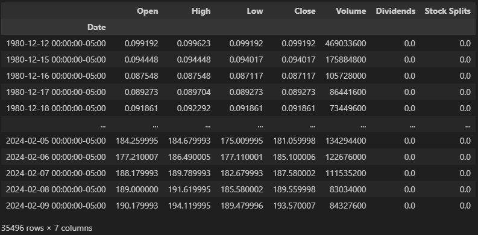
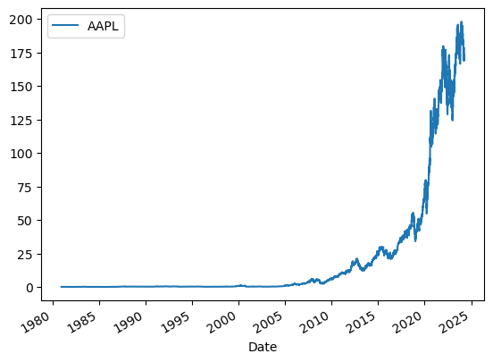
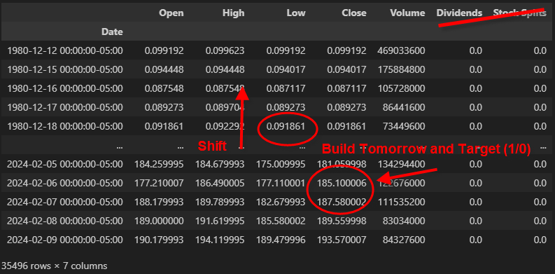
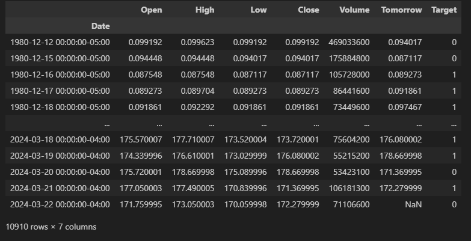

# Finance-Portfolio-Investment
## Overall trend for several NASDAQ Stocks
  
  
  
  
## Collect stocks of a given stock APPL  
  
  

## Define a Target Variable based on the tomorrow value  
Let's drop the columns Dividends and Stock Splits. Stock Splits might be an issue when we backtest the history 
We are building a target variable by pulling the actual value of the stock the following day. We are using the **Shift(-1)** to perform this quick operation  
  
## Run Predictions 
We are going to add as predictors, the information regarding the stock value **2 days ago, a week, 3 months and 4 years** 
The rolling method is useful calculating moving averages or other rolling window calculations in time series data or any sequential data  
  
For APPL, we improve from 51.9% to 53.8% with a probability of 60% to be correct, by using a backtest using up to several months of resuls 
Using a LSTM Neural Network does not provide better results. There is one path to consider, which is to look at the market opened before the USA, like in Japan or London, or the CAC40.