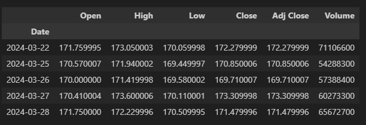
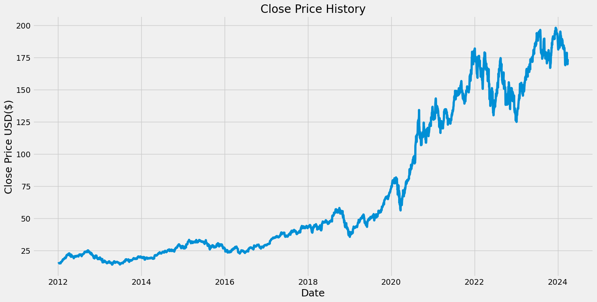
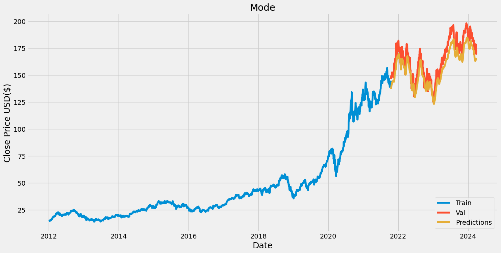

# Finance-Portfolio-Investment

* This project will exercise some Machine Learning algorithms to decide when to invest and anticipate a stock value  
* The stock value will be estimated using first a Deep Learning LSTM model, and next a Deep Learnin LLM model  

## 1. Probability we can guess the trend of a stock at a given date

### Overall trend for several NASDAQ Stocks

  
  
  
  

### Collect stocks of a given stock APPL  

  
  

### Define a Target Variable based on the tomorrow value  

Let's drop the columns Dividends and Stock Splits. Stock Splits might be an issue when we backtest the history 
We are building a target variable by pulling the actual value of the stock the following day. We are using the **Shift(-1)** to perform this quick operation  
  

### Run Predictions 

We are going to add as predictors, the information regarding the stock value **2 days ago, a week, 3 months and 4 years** 
The rolling method is useful calculating moving averages or other rolling window calculations in time series data or any sequential data  
  
For APPL, we improve from 51.9% to 53.8% with a probability of 60% to be correct, by using a backtest using up to several months of resuls 

## 2. Predict a stock value at a given date

Using a **LSTM** Neural Network does not provide better results. There is one path to consider, which is to look at the market opened before the USA, like in Japan or London, or the CAC40  
  
  
  

## 3. Using  a LLM approach

For again the AAPL stock, we are going to use a third approach using GPT 

* A **GPT-2** tokenizer and pre-trained model are extracted from a **transformers** library 
* The historical stocks are used to fine-tune le model 
* Eventually this model is used to estimate the future stock prices   
  
