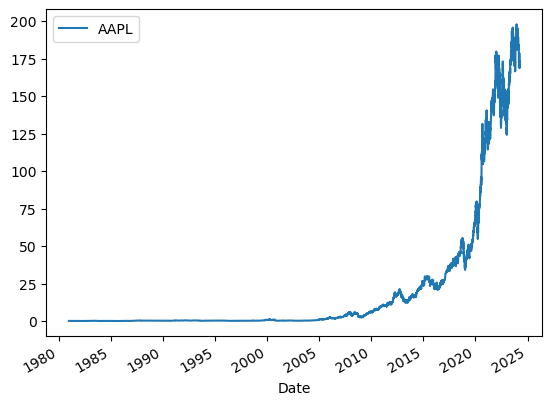
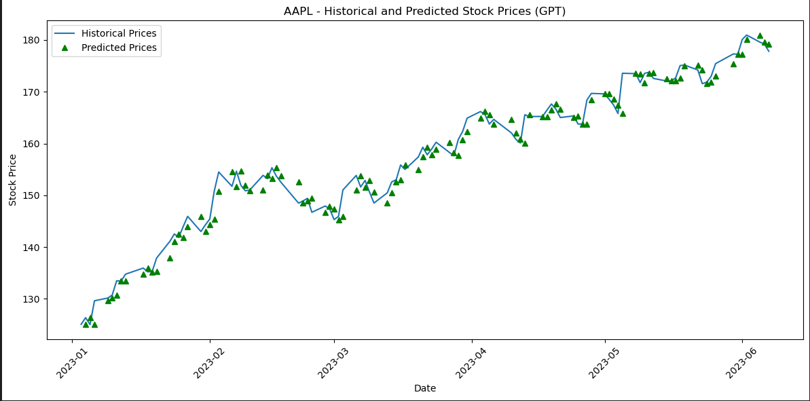

# Finance-Portfolio-Investment

This project exercises different Machine Learning algorithms to challenge the prediction of a stock value. Apple is the stock of choice  
The stock value is estimated using:

## 1. A **Rolling** method to estimate a stock value using its history 2 days ago, a week, 3 months and 4 years ago 

## 2. **LSTM**, a Recurrent Neural Network Deep Learning algorithm, addressing typical Gradient problems using standard RNNs. The model is defined manually, i.e. its number of layers, nodes and loss function 

## 3. **GPT2**, another Deep Learning algorithm based on the **Transformers** architecture, without getting bogged by sequential data processing 

## 4. **OpenAI**, to exercise another way to extract a GPT2 model  <rb>

## 1. Probability we can guess the trend of a stock at a given date

### Collect stocks of a given stock AAPL  

  
  

### Define a Target Variable based on the tomorrow value  

Let's drop the columns Dividends and Stock Splits. Stock Splits might be an issue when we backtest the history 
We are building a target variable by pulling the actual value of the stock the following day. We are using the **Shift(-1)** to perform this quick operation  
  

### Run Predictions 

We are going to add as predictors, the information regarding the stock value **2 days ago, a week, 3 months and 4 years** 
The rolling method is useful calculating moving averages or other rolling window calculations in time series data or any sequential data  
  
For APPL, we improve from 51.9% to 53.8% with a probability of 60% to be correct, by using a backtest using up to several months of resuls 

## 2. Predict a stock value at a given date

Using a **LSTM** Neural Network does not provide better results. There is one path to consider, which is to look at the market opened before the USA, like in Japan or London, or the CAC40  
  
  
  

## 3. Using  a LLM approach bringing up GPT2

For again the AAPL stock, we are going to use a third approach using GPT 

* A **GPT-2** tokenizer and pre-trained model are extracted from a **transformers** library 
* The historical stocks are used to fine-tune le model 
* Eventually this model is used to estimate the future stock prices   
  

## 4. Using a LLM approach calling OpenAI
